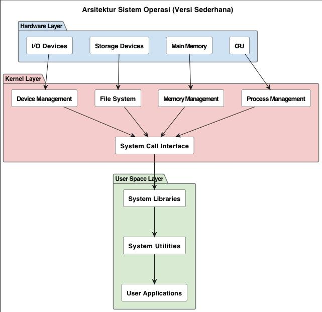

# Laporan Praktikum Minggu [X]
 "Arsitektur Sistem Operasi dan Kernel"]

---

## Identitas
- **Nama**  : [luthfi aulia rahman]  
- **NIM**   : [250202948]  
- **Kelas** : [1 IKRB]

---

## Tujuan

  
> Mahasiswa mampu menjelaskan fungsi utama sistem operasi dan peran kernel serta system call.
Fungsi utama sistem operasi adalah mengelola sumber daya perangkat keras dan perangkat lunak, menyediakan antarmuka antara pengguna dan komputer, serta menjalankan program dengan efisien. Panel adalah komponen dari antarmuka pengguna grafis (GUI) yang memungkinkan pengguna berinteraksi dengan sistem operasi melalui elemen visual seperti ikon dan jendela. Sementara itu, system call adalah jembatan yang memungkinkan program meminta layanan tertentu dari sistem operasi, seperti membaca file atau mengontrol proses, tanpa perlu mengetahui detail kerja perangkat kerasnya

## Dasar Teori
Tuliskan ringkasan teori (3–5 poin) yang mendasari percobaan.

---

## Langkah Praktikum
1. Langkah-langkah yang dilakukan.  
2. Perintah yang dijalankan.  
3. File dan kode yang dibuat.  
4. Commit message yang digunakan.


## Kode / Perintah
Tuliskan potongan kode atau perintah utama:
```bash
uname -a
whoami
lsmod | head
dmesg | head
```

---

## Hasil Eksekusi
Sertakan screenshot hasil percobaan atau diagram:


---

## Analisis
- Jelaskan makna hasil percobaan.  
- Hubungkan hasil dengan teori (fungsi kernel, system call, arsitektur OS).
Hubungan antara fungsi kernel, system call, dan arsitektur sistem operasi (OS) dapat dipahami melalui perbandingan teori dengan hasil praktis yang terjadi saat sebuah program berinteraksi dengan perangkat keras. Secara teori, kernel adalah inti OS yang bertindak sebagai perantara antara perangkat lunak aplikasi dan perangkat keras. System call adalah mekanisme yang digunakan aplikasi untuk meminta layanan dari kernel. Arsitektur OS, seperti monolitik atau mikrokernel, menentukan bagaimana interaksi ini diimplementasikan, yang pada gilirannya memengaruhi kinerja, keamanan, dan stabilitas sistem secara keseluruhan.  
- Apa perbedaan hasil di lingkungan OS berbeda (Linux vs Windows)?  
Perbedaan utama lingkungan OS Linux dan Windows terletak pada sistem file, lisensi,  modularitas, dan keamanannya. Linux memiliki struktur direktori hierarkis berbasis tree yang dimulai dari direktori root ('/'), sedangkan Windows menggunakan partisi drive (seperti C:, D:) dan folder. Linux bersifat open source dan gratis, sementara Windows adalah perangkat lunak komersial berbayar. Linux lebih modular, memungkinkan kustomisasi tinggi, sementara Windows lebih kohesif. Selain itu, Linux umumnya dianggap lebih aman dan stabil daripada Windows.

---

## Kesimpulan
Tuliskan 2–3 poin kesimpulan dari praktikum ini
Kesimpulan arsitektur sistem operasi dan kernel adalah bahwa kernel adalah inti dari sistem operasi (OS) yang bertindak sebagai jembatan antara perangkat keras dan perangkat lunak, mengelola sumber daya seperti CPU, memori, dan perangkat, serta menyediakan layanan penting seperti penjadwalan proses dan manajemen memori. Arsitektur OS bervariasi, seperti monolitik, mikrokernel, dan hibrida, dengan pilihan arsitektur yang memengaruhi kinerja, fleksibilitas, dan keandalan sistem.
---

## Quiz
1. [Pertanyaan 1]  
   **tuliskan 3 fungsi sistem operasi**
     Windows (untuk PC dan server), macOS (untuk perangkat Apple), Linux (sistem operasi open-source untuk berbagai perangkat), Android (untuk perangkat seluler), iOS (untuk perangkat Apple seluler), dan Chrome OS (ringan dan berorientasi web)
   
2. [Pertanyaan 2]  
   **jelaskan perbedan antara konel mode dan user mode**  
   tingkat akses dan hak istimewa yang dimiliki oleh prosesor. Mode pengguna menjalankan aplikasi standar dengan akses terbatas ke perangkat keras dan sumber daya sistem, sedangkan mode kernel menjalankan inti sistem operasi dengan kontrol penuh atas seluruh perangkat keras, memori, dan sumber daya sistem. Pemisahan ini sangat penting untuk menjaga stabilitas dan keamanan sistem, karena mode kernel mencegah aplikasi pengguna yang salah atau berbahaya merusak sistem
3. [Pertanyaan 3]  
   **sebutkan contoh os dan arsitektur monolonithic microkornel** 
   Arsitektur monolitik
Pada arsitektur monolitik, semua layanan sistem, seperti manajemen memori, proses, dan perangkat, diimplementasikan dalam satu ruang kernel yang besar dan tunggal. 
Linux: Salah satu contoh paling terkenal. Meskipun banyak modul dapat dimuat secara dinamis, kernelnya secara keseluruhan tetap bersifat monolitik.
Microsoft Windows (versi lama): Versi Windows seperti Windows 95, 98, dan Me menggunakan arsitektur monolitik.
DOS: Sistem operasi yang sangat sederhana dan monolitik, di mana semua fungsi intinya terintegrasi.
Solaris: Sistem operasi dari Sun Microsystems yang juga menggunakan kernel monolitik.
BSD: Berbagai varian sistem operasi BSD, seperti FreeBSD dan OpenBSD, menggunakan kernel monolitik. 


---

## Refleksi Diri
Tuliskan secara singkat:
- masih kurang paham, masih susah semua?  
  

---

**Credit:**  
_Template laporan praktikum Sistem Operasi (SO-202501) – Universitas Putra Bangsa_
