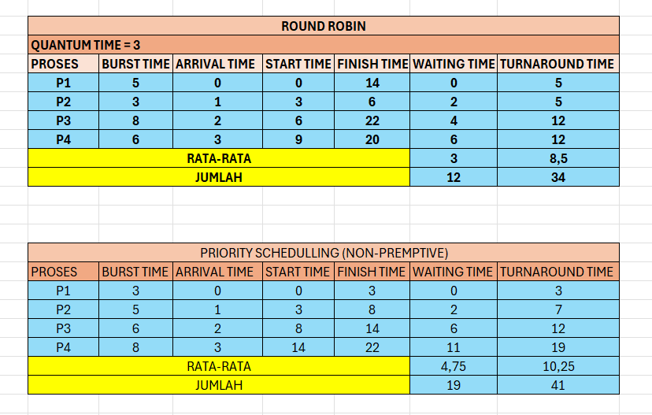

# Laporan Praktikum Minggu [6]
Topik: 
CPU Scheduling RR & Priority
---

## Identitas
- **Nama**  : Luthfi Aulia Rahman
- **NIM**   : 250202948 
- **Kelas** : 1 IKRB

---

## Tujuan


Tuliskan tujuan praktikum minggu ini.

- Menghitung waiting time dan turnaround time pada algoritma RR dan Priority.

- Menyusun tabel hasil perhitungan dengan benar dan sistematis.

- Membandingkan performa algoritma RR dan Priority.


- Menjelaskan pengaruh time quantum dan prioritas terhadap keadilan eksekusi proses.

- Menarik kesimpulan mengenai efisiensi dan keadilan kedua algoritma.
---

## Dasar Teori

- Round Robin (RR) adalah algoritma penjadwalan CPU yang membagi waktu eksekusi menjadi beberapa time quantum sehingga setiap proses mendapat giliran secara bergantian dan adil.

- RR termasuk jenis preemptive scheduling, artinya CPU dapat berpindah dari satu proses ke proses lain setelah quantum habis, untuk menjaga responsivitas sistem.

- Pemilihan nilai time quantum sangat berpengaruh: quantum terlalu kecil menimbulkan context switching berlebih, sedangkan quantum terlalu besar menurunkan keadilan antarproses.

- Priority Scheduling mengeksekusi proses berdasarkan tingkat prioritas; proses dengan prioritas lebih tinggi akan dijalankan terlebih dahulu.

- Kelemahan utama algoritma prioritas adalah potensi terjadinya starvation, yaitu proses prioritas rendah tidak mendapat giliran eksekusi jika proses prioritas tinggi terus datang.
---

## Langkah Praktikum
1. Menyiapkan data proses yang berisi burst time, arrival time, dan priority sebagai dasar perhitungan kedua algoritma.

2. Melakukan simulasi Round Robin dengan menentukan nilai time quantum, menyusun Gantt Chart, serta menghitung waiting time dan turnaround time menggunakan Excel.

3. Melakukan simulasi Priority Scheduling dengan mengurutkan proses berdasarkan prioritas dan menghitung waiting time serta turnaround time melalui tabel di Excel.

4. Menyusun seluruh hasil perhitungan, tabel, dan Gantt Chart ke dalam file laporan.md, kemudian menyimpan hasil screenshot ke dalam folder screenshots.

5. Mengunggah seluruh hasil praktikum ke GitHub


---

## Kode / Perintah
Tuliskan potongan kode atau perintah utama:
```bash
WT[i] = waktu mulai eksekusi - Arrival[i]
TAT[i] = WT[i] + Burst[i]
```

---

## Hasil Eksekusi
Sertakan screenshot hasil percobaan atau diagram:



---

## Analisis
1. Perbandingan angka (hasil praktikum)

RR (q = 3) : avg TAT = 14, avg WT = 8.5

Priority (non-preemptive): avg TAT = 10.75, avg WT = 5.25 Dari angka di atas terlihat Priority lebih cepat menyelesaikan proses (TAT lebih kecil) dan membuat proses menunggu lebih sedikit (WT lebih kecil) pada skenario dan data yang dipakai.

2. Pengaruh time quantum

Dengan q = 2 (kecil) hasilnya memburuk: avg TAT ≈ 17.75, avg WT ≈ 12.25 - karena banyaknya preemption menyebabkan lebih banyak context switching dan penundaan penyelesaian total.

Dengan q = 5 (besar) RR mendekati perilaku non-preemptive: avg TAT ≈ 12.5, avg WT ≈ 7 - lebih baik daripada q = 2/3 untuk dataset ini, tetapi jika quantum terlalu besar RR kehilangan keunggulan interaktivitasnya. Intinya: quantum yang terlalu kecil overhead context switching tinggi; quantum yang terlalu besar → berkurang fairness dan mirip FCFS. Pilih quantum seimbang (sering: sekitar nilai rata-rata burst time kecil) untuk trade-off responsivitas & efisiensi.

 3. Pengaruh prioritas

Prioritas menempatkan proses penting (nilai prioritas kecil) lebih dahulu sehingga menurunkan WT/TAT bagi proses berprioritas tinggi.

Risiko: proses prioritas rendah bisa tertinggal (starvation) jika banyak proses prioritas tinggi terus masuk. Mitigasi umum: aging (meningkatkan prioritas proses yang menunggu lama) atau batas waktu tunggu maksimal.

4. Observasi Gantt dan urutan eksekusi

RR menunjukkan interleaving (giliran bergantian), sehingga proses panjang tetap bergerak maju meskipun tidak tuntas baik untuk fairness.

Priority (non-preemptive) menunjukkan blok eksekusi berurutan menurut prioritas, sehingga proses prioritas rendah menunggu sampai proses prioritas tinggi selesai - efisiensi per proses tinggi tetapi fairness menurun.

5. Keterbatasan percobaan & asumsi

Percobaan memakai dataset kecil dan priority non-preemptive; hasil dapat berubah untuk beban lain (lebih banyak proses, arrival time berbeda, atau priority preemptive).

Overhead context switching diasumsikan tidak bermetrik (tidak dimasukkan ke perhitungan numerik) - pada sistem nyata overhead ini berpengaruh signifikan terutama untuk quantum kecil.

---

## Kesimpulan


###  **Round Robin (RR)**


* Cocok untuk **sistem time-sharing** (misalnya sistem multitasking atau interaktif).
* Memberikan **keadilan (fairness)** karena setiap proses mendapat jatah waktu (time quantum) secara bergiliran.
* **Kinerja sangat bergantung pada besar kecilnya time quantum**:

  * Jika **quantum terlalu kecil**, sistem akan sering melakukan *context switch* → overhead tinggi.
  * Jika **quantum terlalu besar**, kinerjanya mendekati FCFS (tidak efisien untuk interaktif).
* **Tidak terjadi starvation**, karena setiap proses pasti mendapat giliran.

---

###  **Priority Scheduling**


* Memilih proses dengan **prioritas tertinggi** untuk dieksekusi lebih dulu.
* **Efisien** untuk sistem yang membutuhkan penanganan cepat pada proses penting (misalnya sistem real-time).
* **Kelemahannya:** dapat terjadi **starvation** (proses prioritas rendah tidak pernah dieksekusi).
* Dapat diatasi dengan **aging** (menaikkan prioritas proses yang menunggu terlalu lama).


---

## Quiz
1.   Apa perbedaan utama antara Round Robin dan Priority Scheduling?
2. Apa pengaruh besar/kecilnya time quantum terhadap performa sistem?
3. Mengapa algoritma Priority dapat menyebabkan starvation?


---

### **1. Perbedaan utama antara Round Robin dan Priority Scheduling**

| Aspek                   | **Round Robin (RR)**                                                                | **Priority Scheduling**                                                                              |
| :---------------------- | :---------------------------------------------------------------------------------- | :--------------------------------------------------------------------------------------------------- |
| **Prinsip kerja**       | Setiap proses dieksekusi secara bergiliran dengan jatah waktu tetap (time quantum). | Proses dieksekusi berdasarkan prioritas; proses dengan prioritas lebih tinggi dijalankan lebih dulu. |
| **Keadilan (fairness)** | Adil terhadap semua proses karena setiap proses mendapat giliran.                   | Tidak selalu adil; proses prioritas rendah bisa tertunda lama.                                       |
| **Parameter utama**     | Time quantum (berapa lama setiap proses dijalankan).                                | Nilai prioritas (semakin tinggi prioritas, semakin cepat dijalankan).                                |
| **Cocok untuk**         | Sistem **time-sharing** atau **interaktif**, di mana respon cepat dibutuhkan.       | Sistem **real-time** atau **batch**, di mana tugas tertentu harus didahulukan.                       |

---

### **2. Pengaruh besar/kecilnya *time quantum* terhadap performa sistem**

| Ukuran Time Quantum | Dampak terhadap Performa                                                                                                                                                    |
| :------------------ | :-------------------------------------------------------------------------------------------------------------------------------------------------------------------------- |
| **Terlalu kecil**   | - Terlalu sering terjadi *context switch* (perpindahan proses) → overhead CPU meningkat. <br> - Sistem menjadi lambat karena banyak waktu terbuang untuk pergantian proses. |
| **Terlalu besar**   | - Round Robin akan mirip seperti FCFS (First Come First Serve). <br> - Respons ke pengguna menjadi lambat karena satu proses menahan CPU terlalu lama.                      |
| **Idealnya**        | Time quantum harus cukup kecil untuk respons cepat, tapi cukup besar agar *context switch* tidak terlalu sering. Biasanya antara **10–100 ms** pada sistem modern.          |

---

### **3. Mengapa algoritma Priority dapat menyebabkan *starvation*?**

* **Starvation (kelaparan proses)** terjadi ketika proses dengan prioritas rendah **tidak pernah mendapat giliran CPU**, karena selalu ada proses baru dengan prioritas lebih tinggi.
* Contoh:
  Jika proses dengan prioritas tinggi terus masuk ke antrian, proses prioritas rendah akan terus tertunda dan tidak pernah dieksekusi.

**Solusi umum:**
Menggunakan aging, yaitu mekanisme menaikkan prioritas proses yang menunggu terlalu lama agar akhirnya mendapat giliran.

### **Tugas**

1. Hitung waiting time dan turnaround time untuk algoritma RR dan Priority.
2. Sajikan hasil perhitungan dan Gantt Chart dalam laporan.md.
3. Bandingkan performa dan jelaskan pengaruh time quantum serta prioritas.
5. Simpan semua bukti (tabel, grafik, atau gambar) ke folder screenshots/.


| Process ID | Arrival Time (AT) | Burst Time (BT) | Priority (1=Highest) |
| :--- | :--- | :--- | :--- |
| **P1** | 0 | 8 | 2 |
| **P2** | 0 | 4 | 1 |
| **P3** | 0 | 2 | 4 |
| **P4** | 0 | 6 | 3 |

Total *Burst Time* (Waktu Eksekusi Total) adalah 20 unit.

---

## LAPORAN PERHITUNGAN PENJADWALAN CPU

### 1. Algoritma Priority (Non-Preemptive) 

Dalam mode Non-Preemptive, proses dengan prioritas tertinggi (nilai terkecil) akan berjalan hingga selesai.

* **Urutan Eksekusi:** P2 (Prio 1) $\to$ P1 (Prio 2) $\to$ P4 (Prio 3) $\to$ P3 (Prio 4).

#### Gantt Chart 

| P2 (4) | P1 (8) | P4 (6) | P3 (2) |
| :---: | :---: | :---: | :---: |
| 0 $\to$ 4 | 4 $\to$ 12 | 12 $\to$ 18 | 18 $\to$ 20 |

#### Hasil Perhitungan

| Process | BT | Completion Time (CT) | TAT = CT - AT | WT = TAT - BT |
| :---: | :---: | :---: | :---: | :---: |
| **P1** | 8 | 12 | 12 | 4 |
| **P2** | 4 | 4 | 4 | 0 |
| **P3** | 2 | 20 | 20 | 18 |
| **P4** | 6 | 18 | 18 | 12 |
| **Rata-rata** | | | **13.50** | **8.50** |

---

### 2. Algoritma Round Robin (RR) dengan $q=3$ 

Setiap proses mendapat jatah waktu (quantum) sebesar 3 unit. Jika belum selesai, proses di-*preempt* dan kembali ke *ready queue*.

* **Urutan Eksekusi:** P1(3) $\to$ P2(3) $\to$ P3(2) $\to$ P4(3) $\to$ P1(3) $\to$ P4(3) $\to$ P1(2) $\to$ P4(0)

#### Gantt Chart 

| P1 (3) | P2 (3) | P3 (2) | P4 (3) | P1 (3) | P4 (3) | P1 (2) | P4 (0) |
| :---: | :---: | :---: | :---: | :---: | :---: | :---: | :---: |
| 0 $\to$ 3 | 3 $\to$ 6 | 6 $\to$ 8 | 8 $\to$ 11 | 11 $\to$ 14 | 14 $\to$ 17 | 17 $\to$ 19 | 19 $\to$ 20 |

#### Hasil Perhitungan

| Process | BT | Completion Time (CT) | TAT = CT - AT | WT = TAT - BT |
| :---: | :---: | :---: | :---: | :---: | :---: |
| **P1** | 8 | 19 | 19 | 11 |
| **P2** | 4 | 6 | 6 | 2 |
| **P3** | 2 | 8 | 8 | 6 |
| **P4** | 6 | 20 | 20 | 14 |
| **Rata-rata** | | | **13.25** | **8.25** |

---

## 3. Perbandingan Performa & Analisis Parameter 

### Perbandingan Kinerja

| Algoritma | Avg. TAT | Avg. WT | Kesimpulan Kinerja |
| :--- | :---: | :---: | :--- |
| **Priority (Non-Preemptive)** | **13.50** | **8.50** | Prioritas tinggi mendapat pelayanan cepat (WT=0), tetapi proses prioritas rendah mengalami *starvation* (WT=18). |
| **Round Robin ($q=3$)** | **13.25** | **8.25** | Memberikan *fairness* yang lebih baik, mencegah *starvation*, dan menghasilkan rata-rata yang sedikit lebih baik secara keseluruhan untuk data ini. |

Dalam kasus data ini, **Round Robin dengan $q=3$ memiliki performa rata-rata yang sedikit lebih baik** (TAT dan WT lebih kecil) karena mampu memecah waktu eksekusi proses panjang (**P1** dan **P4**), sehingga proses pendek (**P2** dan **P3**) dapat selesai lebih cepat dan tidak terhambat.

### Pengaruh Prioritas

* **Fokus:** Algoritma Priority bertujuan untuk meminimalkan waktu tunggu dan penyelesaian bagi **proses yang dianggap paling penting**.
* **Dampak:** **Waktu tunggu proses prioritas tinggi sangat kecil** (WT P2 = 0). Namun, hal ini menyebabkan **ketidakadilan (*unfairness*)** yang ekstrem dan dapat memicu **starvation** (proses prioritas rendah, P3, harus menunggu paling lama) karena tidak ada jaminan bahwa proses tersebut akan mendapat CPU jika proses prioritas tinggi terus berdatangan.

### Pengaruh Time Quantum ($q$) pada Round Robin

* **Definisi:** $q$ adalah unit waktu maksimum sebuah proses dapat berjalan sebelum di-*preempt*.
* **$q$ Kecil (Misalnya, $q=3$):**
    * **Pro:** Meningkatkan **responsivitas** dan **fairness** karena semua proses segera mendapat giliran.
    * **Kontra:** Menyebabkan **overhead *context switching*** (perpindahan antara proses) yang tinggi, karena CPU harus sering menyimpan dan memuat *state* proses, yang dapat menurunkan efisiensi CPU total.
* **$q$ Besar (Mendekati *Burst Time* Maksimum):**
    * **Pro:** Mengurangi overhead *context switching*.
    * **Kontra:** Perilaku RR akan **mendekati FCFS (First-Come, First-Served)**. RR kehilangan keunggulannya dalam interaktivitas, dan proses pendek harus menunggu proses panjang yang sedang berjalan selesai, mirip dengan Priority (tetapi tanpa mempertimbangkan tingkat kepentingan).


---

## Refleksi Diri
Tuliskan secara singkat:
- Apa bagian yang paling menantang minggu ini?  
- Bagaimana cara Anda mengatasinya?  

---

**Credit:**  
_Template laporan praktikum Sistem Operasi (SO-202501) – Universitas Putra Bangsa_
